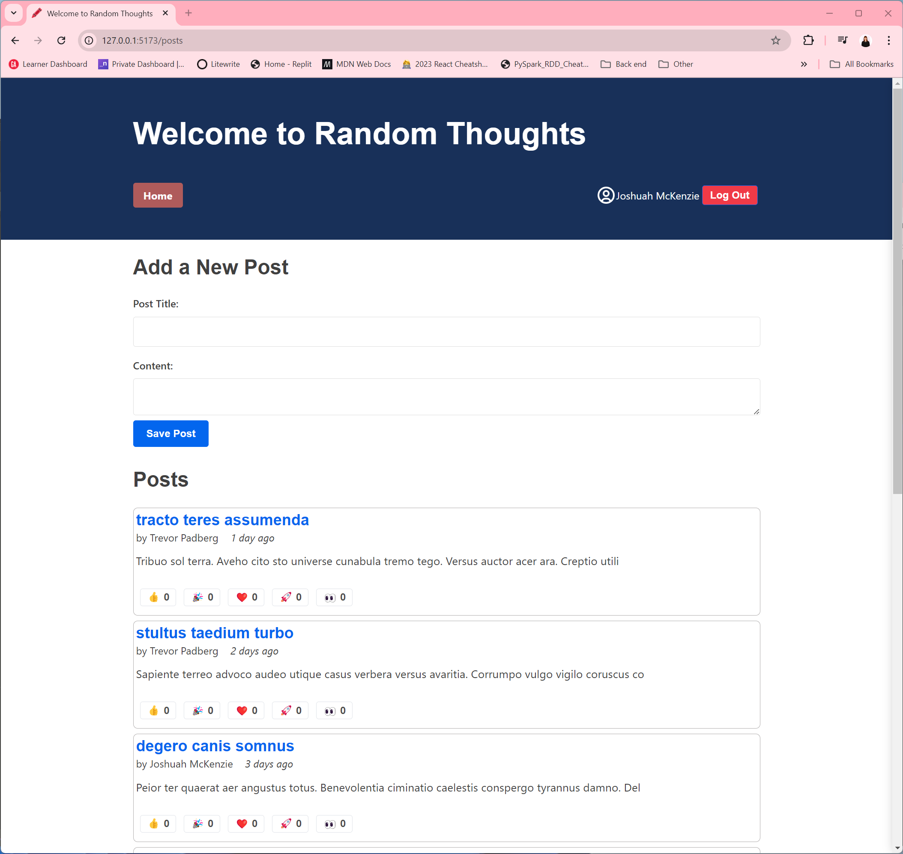

# Simple Redux blog

A quick blog to learn the fundamentals of Redux, based on the official Redux Essentials tutorial.



## Features

1. Full read and edit across posts
2. State management for posts, users and auth
3. Reaction buttons on posts for user engagement
4. Simple log in form protected via protected routes

## Getting Started

1. Clone the repository:

```bash
git clone https://github.com/your-username/Simple-Redux-Blog.git
```

2. Install dependencies:

```bash
cd Simple-Redux-Blog
npm install
```

3. Start the development server:

```bash
npm start
```
